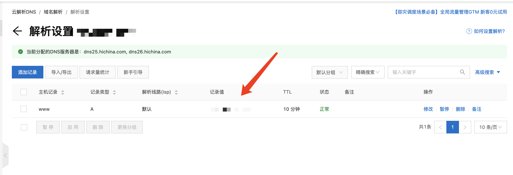

## 胎教级教你利用DDNS通外网访问个人NAS（以群晖为例）
> 2022/09/09 @NAZA
> 阅读本文，你将从搞定从网络服务到平台设置，并且白话讲解原理，手把手教你利用DDNS访问到个人家庭NAS。本方法需要一定的成本，主要是购买域名的费用。
## 需求背景
有很多人拥有了NAS之后，想要在公网也能够随时随地的访问NAS。根据NAS平台不同，有许多方法可以实现这一点。本文将介绍一个比较通用的方法，可能得花一点小钱，但能够达到不错的效果，大部分NAS平台基本都支持这个方法，即，利用域名服务商提供的DDNS服务来实现用域名访问NAS。

## 原理
本节将介绍DDNS的原理，不了解也不影响使用，但简单理解一下本方法的原理，如果使用过程中遇到什么问题，也能够有一些初步的判断。
DDNS（Dynamic Domain Name Server），是将用户的动态IP地址映射到一个固定的域名解析服务上，这句话解释了DDNS的基本用途。
## 使用DDNS的准备工作
> 本部分会讲解搭建DDNS服务你需要准备的东西，以下每小节都会讲解准备操作，并在末尾总结
### 网络的准备
一般来说，由于运营和法规等等复杂的原因，宽带运营服务商不会主动提供给个人或家庭**固定的公网IP**，也就是说，你的家庭网络的IP实际上是一个大型局域网的内网IP，网络运营商会统一对你所在的局域网进行网络信息的转发，在公网上是不能直接访问到的。所以我们首先要搞定的，就是将我们的家庭网络改成**公网IP**
在我国，个人或家庭用的宽带网络比较混乱，很多家庭接入的都是一些二级运营商，比如歌华，宽带通、长城宽带、华数宽带，等等，这些运营商不一定支持提供**公网ip**，如果你的网络是这种二级运营甚至听都没听过的三级运营商，那么你基本不可能用有外网ip了（不过你也可以打电话问问客服，万一呢？）这种情况下，无法使用DDNS服务，想要外网访问NAS那么你需要通过别的方法来实现了。
如果你确定你的家庭网络是直接连入的联通，电信，移动这三家一级运营商，那么你已经成功了一半。
根据以上内容，确定了服务商支持后，需要确定自己的网络结构，是否已经是外网ip了，这部分内容可以直接打电话给客服解决，如果想要自己先确定一下，那么看下面注释。或者不想理解可以直接跳过看**需要跟客服说明的情况**。

>  一般来说，家庭接入网络，会有两个部件，**光猫**和**路由器**，有的人会说，我家接入的网络只有一个光猫啊，没有路由器，网线和wifi直接连的光猫。首先我们得先知道光猫的作用，现在“光纤”基本已经普及，我们家庭里接入的光纤，运输的是光信号是，光纤是一根透明的“玻璃丝”，服务商通过长短不一的光去照射这根玻璃丝的一端，那么然后你在另一端，就能接收到这些一闪一闪光，然后这些光闪烁的频率就是信息，光猫的作用，就是把这些闪光的信息，通过一套非常复杂的转换规则，转换成机器可以识别的电信号，这是光猫的本职功能。**路由器**，则是对家庭的设备分发网络，建立一个局域内网，给设备提供局域网ip。现在运营商给的光猫，除了上面说的光电信号转换的功能，内部还内置了一个路由器功能，但一般来说性能都很差，所以一般组网之后，会外接一个路由器，用这个路由器去分配网络。

**直接给你需要跟客服说明的情况：**
1. 根据客服电话提示，转接宽带人工服务。
2. 要求客服将光猫改成**桥接模式**，也就是关闭光猫的路由功能，让光猫只进行光电转换，这是开启公网ip的潜质条件。
3. 同时，要求客服将家庭宽带改成**公网IP**
4. 以上内容要求完毕后，宽带师傅可能需要上门操作。

**注意注意注意**，这里有一点，光猫改成**桥接模式**之后，就只剩下光电信号转换功能了，需要你使用自己的路由器进行**网络拨号**，这里一定要看看自己的路由器是不是支持拨号上网功能，一般来说，现代的路由器基本都支持。另外，由于改成了**桥接模式**，光猫不需要承担路由器功能，网络结构优化，你的网络性能或许也能有所提高。

以上搞定之后，你已经拥有了**公网ip**，可以直接从公网访问你的nas了。
首先，需要将你的nas访问地址的端口，映射到你的路由器端口转发列表上，这部分，根据不同的nas平台，可能有大同小异不同的操作，请各位根据自己的NAS平台和路由器自行搜索，**你需要完成以下操作。**
1. 设置你的路由器端口转发，使得外网访问你的路由器，都会转发到你的nas上。如果你只打算外网访问nas，可以设置为DMZ模式，将你的nas地址配置到路由器中的DMZ地址，这样所有的外网访问，都会直接转发到你的nas上。
2. 从路由器中获取你当前的IP地址。

**目前你已经实现了从局域网到外网的访问，原来需要如局域网ip+端口，如192.168.10.1:5001，现在可以换为公网ip+端口，如123.123.2.1:5001，你可以随时随地的访问你的NAS了！**

**那么有人会问，到这里不是已经可以了吗？**
确实，如果单纯是为了公网访问，这样已经没问题了，但是，**公网ip不等于固定公网ip**，你现在的ip，是会随着时间变化的，等同于公网ip会随着运营商的设置不固定时间变化。比如，你今天的ip是123.123.2.1，明天某个时间点，你的ip会变成123.123.2.2，你需要不停的修改你的访问ip去访问nas，非常的不方便。
**那么可以把这个ip固定下来吗？**
答案是不确定，因为ip不是无限的资源，所以运营商一般不会免费提供给个人固定ip的服务，你可以打电话咨询一下，以北京联通朝阳区为例，北京联通朝阳区个人固定ip服务，每个月需要缴纳30到100元的费用，截止目前本文撰写日（2022年9月9日）的咨询结果是100元。根据不同区域的政策不同，服务商不同，当地运营策略不同，这个费用并不是固定的，有的区域可以免费，有的地区甚至没有这个服务，这个需要各位自己去打客服电话确定，如果可以免费拿到固定的公网ip，那么就不需要DDNS服务了。
**因此，为了实现不换地址随时随地访问，我们需要通过域名去访问我们的nas，让我们总结一下本节准备好的内容，然后进入下一节**

### 网络准备的总结
1. 一个已经改好的桥接模式的光猫
2. 一个可以拨号上网路由器
3. 申请好的**动态公网Ip**
4. 已经配置好的路由器到NAS的端口映射
5. 可以在公网通过**此时查询的公网ip+端口**访问到NAS

## 域名的准备

为了可以不每次连接nas都得重新查询一遍ip，我们需要通过某种方法固定一个访问地址，上文已经提到过一种，就是要求运营商提供固定ip地址，这种方式好处是简单，坏处是费用一般比较高，而且运营商不一定会支持这种服务。那另一种，就是本文的主要介绍的方法，通过DDNS来访问我们的nas了。为了实现这个方法，我们首先需要准备一个域名。国内大大小小有很多提供域名的服务商，并且基本都提供免费的DDNS服务，本文我们以比较流行的阿里云为例，通过阿里云购买域名来实现DDNS服务。这也是本方法唯一的成本，注册域名的费用。
1. 搜索“阿里云域名”，进入到域名搜索页面。截止到目前，地址为
   https://wanwang.aliyun.com/domain/searchresult/#/?keyword=ceshi&suffix=com
2. 搜索心怡的域名地址，域名的价格跨度相当大，尤其是.com的域名从十几块到几十万几百万都有可能，但使用上并没有什么区别，仔细挑选便宜实用的即可。

**由于国内的法律法规的要求，为了防止域名的滥用和违法违规的实用，域名的正常使用需要进行实名认证，根据服务商的提示，进行实名认证即可。**

## 搭建DDNS的详细步骤

好了，至此我们该准备的都准备完成了，下面可以开始真正的搭建了。
我们的核心需求是通过**域名**访问到NAS，但是我们手里只有**动态公网ip**，域名解析只能写死，我们也不可能每次都去重新编辑已经配置好的解析内容。
**这应该怎么办呢？**
答案很简答，你需要一个“机器人”，这个机器人，每隔一段时间就检查一下你的ip有没有什么变化，如果有变化了，机器人就去帮你改一下域名的解析地址，这个“机器人”就是DDNS的服务。

在你的家庭网络上，你需要跑一个程序，用于检查你的本机ip，如果有变化，就给服务商发送请求，更新域名指向的ip。

这个程序需要一个运行平台，一些比较先进的路由器内置了这种功能。但并不是每个路由器都有，所以我们还是把这个“机器人”放到我们的nas上。由于服务商和nas平台也很多，我这里仅仅通过阿里云+群晖的方式来给大家演示一下。具体的大家可以通过自己的平台组合来进一步搜索，这里大家主要理解一下这个方法的核心思想。现在我们开始。
按照以下顺序点击，群晖的控制面板—>连接性:外部访问->DDNS，到此，我们可以看到群晖内置的DDNS配置。

可以看到图中列表，截止到目前版本的群晖，内置的ddns并不直接支持阿里云的服务。因此我们需要自己实现发送消息的程序，但幸运的是，互联网是一个乐于分享的世界，已经有很多别人写好的程序供我们使用了，只要简单的配置，就能很快实现。这里，我们选择比较简单的Docker镜像市场，找一个实现好的DDNS机器人（这里仅仅是为了大家方便理解，把这个程序叫做机器人，以下提到机器人，都是指这个程序）。
## 第一步：下载DDNS程序
打开群晖内置的docker套件，点击注册表，搜索aliyun-ddns-cli，可以看到这个已经写好的程序。这里是这个作者的github，可以去给他点个赞honwen <https://github.com/honwen>

## 第二步：获取阿里云配置信息
我们不可能让任何人随意修改我们的阿里云资源信息，所以要给我们的机器人程序一个修改信息的权限，也就是让机器人“登陆”阿里云的账号密码。当然我们不是直接用真正的账户密码，而是给机器人一个“密钥”，让机器人每次检查到ip变化的时候拿着这把钥匙去修改ip。获取方法如下：
1. 进入阿里云控制台，指向右上角头像，点击AccessKey管理，目前的版本会弹窗提示你是否使用子账户，我们点击，进入RAM 访问控制页面，创建子账户。使用子账户的目的是为了限制“钥匙”的权限，让“钥匙”只能用来使用DDNS服务，这样就算“钥匙”泄露了，也不会对你的账户造成太大的影响。

2. 把这里填一填，**注意：访问方式只选择Open API 调用访问**
3. 创建好后我们返回用户列表，点击刚才创建的用户，进入到用户详情页后，点击权限管理，点击新增授权，如下图
   
4. 授权范围选整个云账号，搜索**AliyunDNSFullAccess**权限，也就是给当前账号修改域名云解析的权限，点击添加，然后点确定。

5. 然后点击认证管理，点击创建AccessKey
6.  **注意，这里的AccessKey Secret只有这一次显示的机会，一定要保存下来，不然关闭这个弹窗之后就找不到了**

7. 至此，我们拿到了“钥匙”

## 第三步：预先给域名添加一条云解析记录

这个步骤并不是所有的运营商都需要的，只是经过测试阿里云不提前添加的话，会导致机器人修改解析的时候找不到解析的地址。
1. 打开阿里云域名控制台找到我们买的并且已经实名认证过的域名，点击解析按钮

2. 如图，记录值就是我们的内网ip地址，这里可以暂时先填一个0.0.0.0，机器人生效后会帮我们自动修改。主机记录这里填一个喜欢的二级域名，通常是www。

3. 点击确定

## 第四步：启动DDNS服务
1. 在docker的映像界面，点击刚才下载好的程序
2. 在弹出的页面里，点击高级设置

3. 点击环境，这里是程序作者的给出的一些环境变量。AKID就是刚才保存的子账户的AccessKey ID，AKSCT就是AccessKey Secret，DOMAIN就是刚才设置的解析域名，要写完整，比如www.baidu.com，REDO这项，就是机器人检查ip变化的间隔，我们填60，就是每1分钟，机器人就回去看看ip有没有变化。

4. 点击应用，再点击下一步，检查一遍信息是否填写正确。
5. 检查无误后点击完成，我们的机器人就开始工作啦。

## 第五步：检查是否成功
回到域名解析配置页面，刷新页面，我们发现机器人已经帮我们把解析值改好啦！以后我们的机器人，每1分钟就会帮我们检查一遍ip有没有变化，然后帮我们修改域名解析。
然后通过域名:端口，就可以直接访问到我们的nas服务了，可喜可贺。

## 结语
以上就是DDNS的全部流程了，虽然只是以阿里云+群晖为例子，但是不同的平台操作基本一致，大家根据自己的平台，然后所有对应的方法即可，重要的是理解ddns的作用。