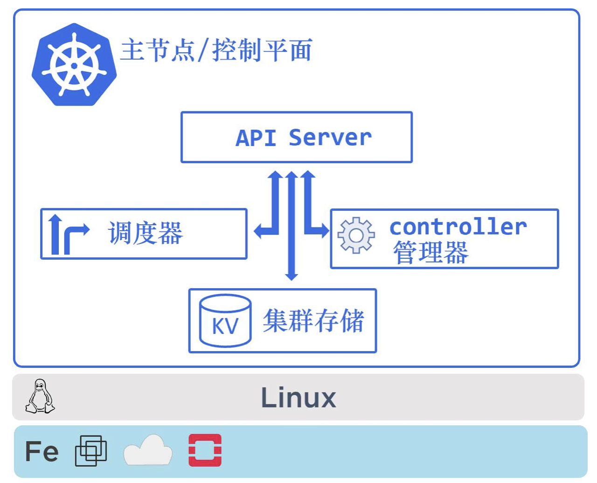

# Kubernetes Note

## k8s操作概览
### k8s主要承担了2个角色
- 支撑应用运行的集群。作为集群的Kubernetes，正如集群的字面含义一样：包含若干个节点与控制平面。控制平面对外提供API，对内负责各节点的任务分配与调度，并在持久化存储中记录各节点的状态。应用服务就运行在每个节点上。
- 支持云原生微服务的编排器。编排器（orchestrator）这个词其实是为了更方便地概况一个包含应用部署与管理的系统，而没有太多的实际含义。

### 主节点和工作节点
一个Kubernetes集群由主节点（master）与工作节点（node）组成。这些节点都是Linux主机，可以运行在虚拟机（VM）、数据中心的物理机，或者公有云/私有云的实例上。

### 主节点（控制平面）
Kubernetes的主节点（master）是组成集群的控制平面的系统服务的集合。

### API Server
API Server（API服务）是Kubernetes的中央车站。所有组件之间的通信，都需要通过API Server来完成。在接下来的章节中将会对这部分进行深入的介绍，但理解全部组件的通信都是通过API Server来完成这一点非常重要，这包括了系统内置组件以及外部用户组件。

### 集群存储
在整个控制层中，只有集群存储是有状态（stateful）的部分，它持久化地存储了整个集群的配置与状态。因此，这也是集群中的重要组件之一——没有集群存储，就没有集群。

### Conctroller管理器
controller管理器实现了全部的后台控制循环，完成对集群的监控并对事件作出响应。controller管理器是controller的管理者（controller of controller），负责创建controller，并监控它们的执行。

### 调度器
从整体上来看，调度器的职责就是通过监听API Server来启动新的工作任务，并将其分配到适合的且处于正常运行状态的节点中。为了完成这样的工作，调度器实现了复杂的逻辑，过滤掉不能运行指定任务的工作节点，并对过滤后的节点进行排序。排序系统非常复杂，在排序之后会选择分数最高的节点来运行指定的任务。

## 工作节点
工作节点是Kubernetes集群中的工作者。从整体上看，工作节点主要负责如下3件事情。
1. 监听API Server分派的新任务。
2. 执行新分派的任务。
3. 向控制平面回复任务执行的结果（通过API Server）。

## K8s的应用打包
一个应用想要在Kubernetes上运行，需要完成如下几步。
1.将应用按容器方式进行打包。
2.将应用封装到Pod中。
3.通过声明式manifest文件部署。